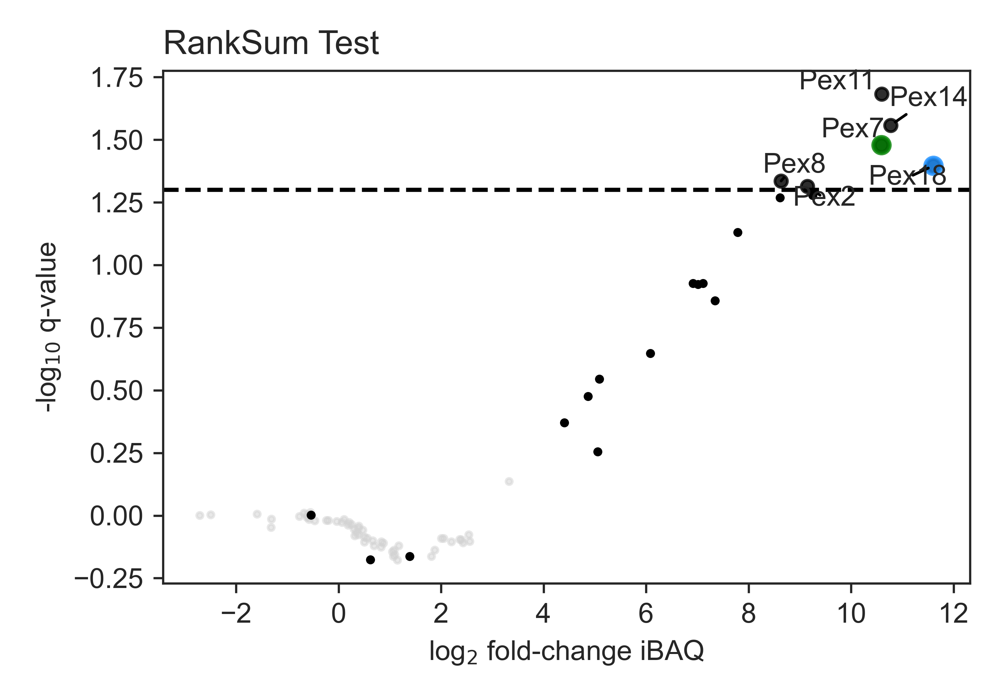
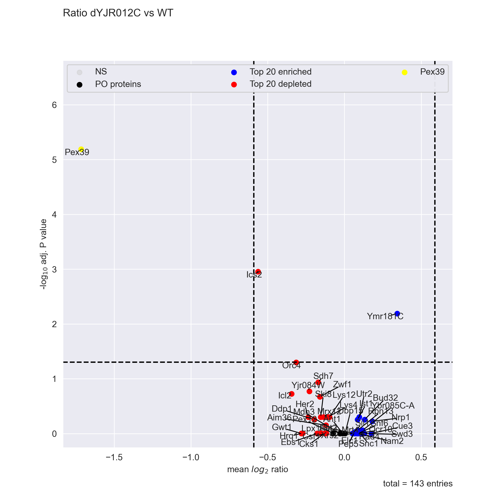

# Pex39 manuscript analysis scripts
This repository contains data analysis scripts for the manuscript "PEX39 is a Peroxin that facilitates the peroxisomal import of PTS2 proteins".

## System requirements
- Scripts are provided as [Jupyter notebooks](https://jupyter.org/) separately for the Pex18 and Pex39 results.
- Analysis was performed using modules from [the autoprot project](https://github.com/ag-warscheid/autoprot) which need to be installed on your local computer
  - Autoprot integrates Python and R scripts for proteomics data analysis and therefore requires both languages to be installed
- Software dependencies are detailed in the ''requirements.txt'' file in the autoprot repository
  - However, detailed information on all installed packages during execution including version numbers are provided in the respective notebooks (as ''environment.txt'' and ''R_environment.csv'' respectively)
- The scripts were tested with Python 3.10 and R 4.2.2 on MS Windows 10 and Ubuntu 22.04 LTS.

## Installation guide
- Install autoprot on your local computer (see installation instructions on [the autoprot repository](https://github.com/ag-warscheid/autoprot)).
  - All analyses in this repository were performed with autoprot and cannot be run without it.
- Installation time largely depends on the time required to compile the R packages.
  - With a fast internet connection, the installation on a standard desktop computer should take less than 30 minutes.
- No non-standard libnraries or hardware are required to run the scripts

## Demo
- This repository contains demo data in the folder ''data/txt_demo'' of each subfolder.
  - The demo data is a subset of the original data and is used to demonstrate the analysis workflow.
  - For Pex18-TPA, all peroxins (Gene name PEX) and 100 random protein groups were included in the demo data.
  - For Pex39 KO, Pex39 (YJR012C) and 150 random protein groups were included in the demo data.
- Each analysis script will use the demo data by default.
- To run the demo, simply run the jupyter notebooks in numeric order.
- If the script completes without errors you can expect the following final figures for Pex18 and Pex39 respectively:
- Expected run time for the demo is less than 5 minutes on a standard desktop computer.

## How to use with the original data

### Pex18-TPA data analysis
- Download the results files from PRIDE (https://www.ebi.ac.uk/pride/archive/projects/PXD051501)
- Save and extract the txt folder inside the folder ''data''
- With autoprot installed, run the jupyter notebooks in numeric order

### Pex39 KO data analysis
- Download the results files from PRIDE (https://www.ebi.ac.uk/pride/archive/projects/PXD051550)
- Save and extract the txt folder inside the folder ''data''
- With autoprot installed, run the jupyter notebooks in numeric order

## How to get help
If something does not work as expected, please reach out to us via the GitHub issues function.
